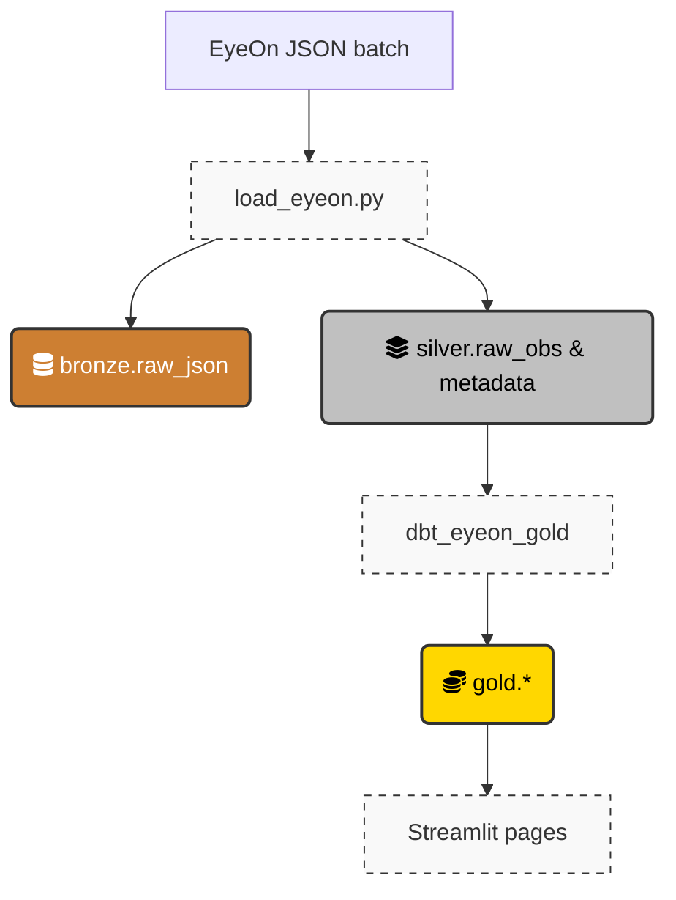

# pEyeON-Analytics

`pEyeON-Analytics` is a local analytics stack for EyeOn output.

It combines:
- `dlt` to load EyeOn JSON into DuckDB
- `dbt` to build analysis-friendly models
- `Streamlit` to explore batches, metadata, schema changes, and certificate data

The upstream EyeOn scanner lives separately in [pEyeON](https://github.com/llnl/pEyeON).

## Overview

EyeOn emits one JSON observation per scanned file. This repository turns those JSON files into queryable tables with a simple local workflow:

1. Generate a batch of EyeOn JSON
2. Launch the Streamlit app
3. Select one or more batches and click `Load Selected`
4. Explore the loaded data

The pipeline is organized into three layers:

- `bronze`: raw JSON retained for traceability
- `silver`: normalized observation and metadata tables loaded from EyeOn JSON
- `gold`: dbt models for reporting and exploration

## Quickstart

### Prerequisites

- Python 3.13
- `uv` - [Install UV](https://docs.astral.sh/uv/getting-started/installation/)
- Docker or Podman
- a directory of files to scan with EyeOn

### 1. Install dependencies

```bash
uv sync
```

### 2. Configure local paths

Copy the sample config and update the dataset location.

```bash
cp EyeOnData.toml-template EyeOnData.toml
```

At minimum, set `datasets.dataset_path` in `EyeOnData.toml` to the directory where EyeOn batch folders should be written.

Example:

```toml
[datasets]
dataset_path = "/path/to/eyeon/batches"

[db]
db_file = "eyeon.duckdb"
db_path = "database"
```

### 3. Generate a batch with EyeOn

Use the wrapper script to run `eyeon parse` in a container:

```bash
./eyeon-parse.sh --util-cd UTIL_CD --dir /path/to/files --threads 8
```

The script writes a timestamped batch directory under `datasets.dataset_path`.

You can also use positional arguments:

```bash
./eyeon-parse.sh UTIL_CD /path/to/files 8
```

For more options:

```bash
./eyeon-parse.sh --help
```

Optional: print a quick summary of the newest batch:

```bash
./eyeon-batch-summary.sh
```

### 4. Launch the Streamlit app

```bash
uv run streamlit run EyeOnData.py
```

### 5. Load batches from the app

The preferred workflow is to use the Streamlit app to run the load pipeline.

From the app:
- choose the dataset root / database location if prompted
- select one or more EyeOn batch directories
- click `Load Selected` to run the load workflow

This path handles the DLT load and the dbt modeling steps for normal usage.

## Optional Manual Workflow

The direct CLI commands below are still useful for development, troubleshooting, or incremental reruns.

### Load a batch with the loader

Run the loader against a specific batch directory:

```bash
uv run python load_eyeon.py --utility_id UTIL_CD --source /path/to/batch --log-level INFO
```

Useful log levels:
- `INFO` for normal runs
- `DEBUG` for more verbose troubleshooting

### Build dbt models manually

```bash
uv run dbt build --project-dir dbt_eyeon_gold --profiles-dir dbt_eyeon_gold
```

## Repo Layout

- `load_eyeon.py`: loads EyeOn JSON into DuckDB via `dlt`
- `eyeon-parse.sh`: container wrapper around `eyeon parse`
- `eyeon-batch-summary.sh`: quick batch inspection helper
- `dbt_eyeon_gold/`: dbt project for modeled analytics tables
- `pages/`: Streamlit pages
- `utils/`: shared app and schema utilities
- `schemas/`: generated DLT schema plus bootstrap SQL
- `extras/`: notebooks and scratch utilities for ad hoc exploration

## Data Flow



## Notes

- `schemas/eyeon_metadata.schema.yaml` is generated as part of the DLT workflow and is intentionally checked in.
- `EyeOnData.toml` is local configuration and should not be committed.
- `test.sh` is a simple local smoke-test script and assumes local sample data paths exist.

## Development

Run linting and formatting with Ruff:

```bash
uv run ruff check .
uv run ruff format .
```
