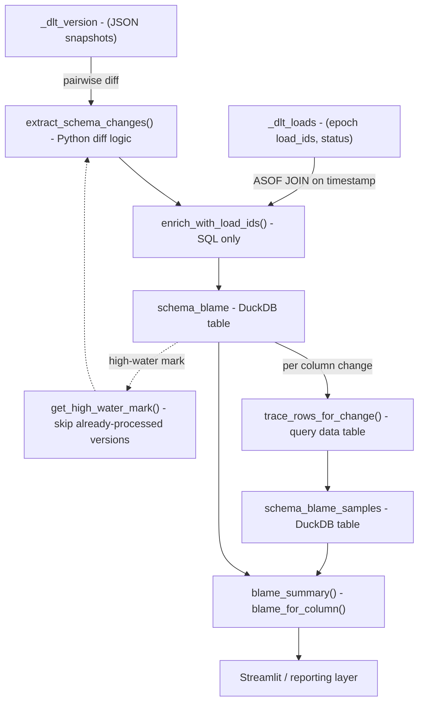

# schema_blame — Design & Reference

Track dlt schema evolution over time and trace every change back to the load
and data rows that caused it. Think of it as **git blame** for your pipeline schema.

---

## Data Flow



---

## Source Tables (dlt internals)

| Table | Key Columns | Role |
|---|---|---|
| `_dlt_version` | `schema_version`, `inserted_at`, `schema` (JSON) | Full schema snapshot at each change event |
| `_dlt_loads` | `load_id` (epoch float), `inserted_at`, `status` | One row per pipeline run; `status=0` means success |
| _(data tables)_ | `_dlt_load_id`, `_dlt_id` | Every row is stamped with the load that created it |

---

## Output Tables

### `schema_blame`
One row per schema change event.

| Column | Type | Description |
|---|---|---|
| `version_from` | INTEGER | Schema version before the change |
| `version_to` | INTEGER | Schema version after the change |
| `version_at` | TIMESTAMP | When the new version was written |
| `load_id` | VARCHAR | Epoch string of the responsible load |
| `change_type` | VARCHAR | See change types below |
| `table_name` | VARCHAR | Data table affected |
| `column_name` | VARCHAR | Column affected (NULL for table-level changes) |
| `detail` | JSON | Before/after values, column definitions, etc. |
| `processed_at` | TIMESTAMP | When this blame record was written |

### `schema_blame_samples`
Sample data rows from the load that caused each column change.

| Column | Type | Description |
|---|---|---|
| `version_to` | INTEGER | Links back to `schema_blame` |
| `load_id` | VARCHAR | The responsible load |
| `table_name` | VARCHAR | Source data table |
| `column_name` | VARCHAR | The changed column |
| `change_type` | VARCHAR | mirrors `schema_blame.change_type` |
| `sample_row` | JSON | Full data row serialized as JSON |
| `processed_at` | TIMESTAMP | When this sample was captured |

---

## Change Types

| `change_type` | Meaning | Samples captured? |
|---|---|---|
| `new_table` | A table appeared in the schema for the first time | No — table-level only |
| `dropped_table` | A table was removed from the schema (data remains) | No |
| `new_column` | A column was added to an existing table | Yes — rows where column IS NOT NULL |
| `dropped_column` | A column was removed from the schema | Yes — last rows before removal |
| `column_type_changed` | dlt widened or changed a column's data type | Yes — rows from the responsible load |
| `column_nullable_changed` | Nullability constraint changed | Yes — rows from the responsible load |

---

## Design Decisions

### ASOF JOIN for load attribution
DuckDB's `ASOF JOIN` finds the greatest right-side timestamp that is ≤ the
left-side timestamp. This cleanly expresses the causal relationship: *the load
that completed just before the schema version was written is the load that
caused the change.* No fuzzy window arithmetic needed.

```sql
SELECT c.version_to, l.load_id
FROM _tmp_changes c
ASOF JOIN (
    SELECT load_id, to_timestamp(load_id::double) AS load_ts
    FROM _dlt_loads WHERE status = 0
) l ON c.version_at >= l.load_ts
```

### Incremental processing
`get_high_water_mark()` reads `MAX(version_to)` from `schema_blame`. On each
run, only schema versions above that mark are diffed and written. Safe to
schedule as a recurring job — no deduplication logic needed.

### Internal table/column filtering
dlt's own bookkeeping tables (`_dlt_version`, `_dlt_loads`, etc.) and columns
(`_dlt_id`, `_dlt_load_id`, etc.) are stripped before diffing. This ensures
only your domain schema changes appear in the blame output.

### Detail JSON is intentionally flexible
Rather than a rigid schema for before/after values, `detail` is a JSON blob
that carries what's meaningful for each change type:
- `new_column` → full column definition dict
- `column_type_changed` → `{"from": "bigint", "to": "text"}`
- `new_table` → list of initial column names

---

## Usage

```python
import duckdb, dlt
from schema_blame import materialize_schema_blame, blame_for_column

pipeline = dlt.attach(pipeline_name="eyeon_metadata")
db_path  = pipeline.dataset().credentials.database

with duckdb.connect(db_path) as conn:
    # run incrementally — safe to call on a schedule
    materialize_schema_blame(conn)

    # inspect a specific column's history + sample rows
    df = blame_for_column("file_metadata", "pe_imphash", conn)
    print(df)
```

---

## Tests
To confirm this all works as expected, here are some simple tests.

1. Start with no schema defined, watch as it magically evolves.
2. Start with a minimal schema, load a few files that:
    1. Make no new changes
    2. Add tables/columns
    3. More files that shouldn't make any changes

## Future Work

- **Type change severity scoring** — distinguish safe widenings (`int` → `double`) from breaking changes (`text` → `int`)
- **Streamlit view** — filterable blame table with expandable sample rows
- **Alert hooks** — flag `new_table` events that correspond to novel event types in eyeon telemetry
- **Cross-pipeline comparison** — diff schema_blame across pipeline environments (dev vs prod)