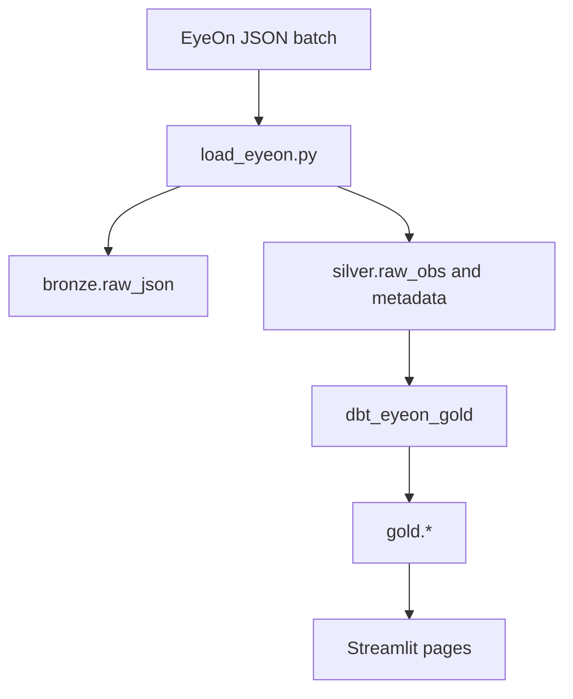

# Data Flow: Bronze → Silver → Gold

## Purpose

`pEyeON-Analytics` turns EyeOn's one-JSON-observation-per-file output into
queryable DuckDB tables and Streamlit views. The README defines a simple local
workflow: generate a batch of EyeOn JSON, launch the Streamlit app, select one or
more batches, click `Load Selected`, and explore the loaded data.

<!-- GROUND_TRUTH: ../pEyeON-Analytics/README.md §overview -->

## Layers

The pipeline is organized into three layers:

| Layer | Role |
| --- | --- |
| `bronze` | Raw JSON retained for traceability |
| `silver` | Normalized observation and metadata tables loaded from EyeOn JSON |
| `gold` | dbt models for reporting and exploration |

<!-- GROUND_TRUTH: ../pEyeON-Analytics/README.md §overview -->

## Pipeline Shape



<!-- GROUND_TRUTH: ../pEyeON-Analytics/README.md §data-flow -->

## Normal Usage Path

The preferred path runs the load pipeline from the Streamlit app. Users choose
the dataset root or database location if prompted, select one or more EyeOn batch
directories, and click `Load Selected`. The README states that this path handles
both the DLT load and dbt modeling steps for normal usage.

<!-- GROUND_TRUTH: ../pEyeON-Analytics/README.md §load-batches-from-the-app -->

## Manual Path

For development, troubleshooting, or incremental reruns, the README documents
manual commands for the loader and dbt:

```bash
uv run python load_eyeon.py --utility_id UTIL_CD --source /path/to/batch --log-level INFO
uv run dbt build --project-dir dbt_eyeon_gold --profiles-dir dbt_eyeon_gold
```

<!-- GROUND_TRUTH: ../pEyeON-Analytics/README.md §optional-manual-workflow -->

## Related

- [[wiki/components/load_eyeon]] — DLT loader component
- [[wiki/components/dbt_gold]] — dbt project component
- [[wiki/components/streamlit_app]] — app-led normal workflow
- [[wiki/decisions/bronze_silver_gold]] — layer architecture decision
